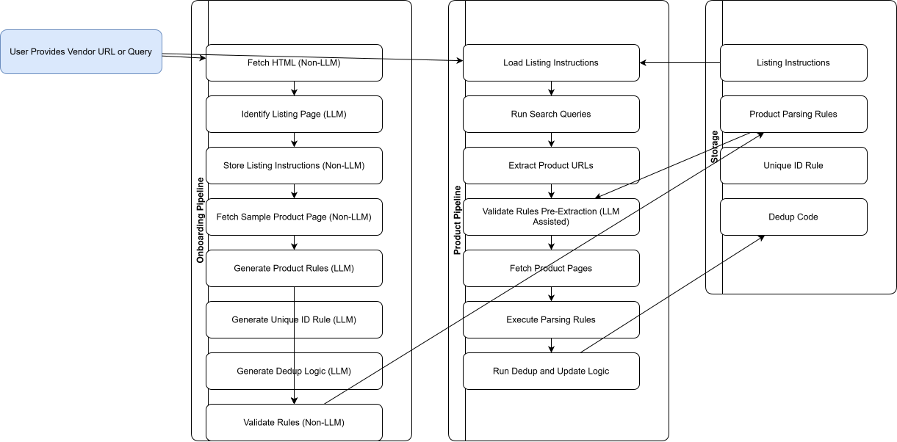

# Architecture Document

## 1. Overview

This document describes the **LLM-assisted product onboarding and product ingestion pipeline** used to automatically understand new vendor websites, generate extraction rules, validate them, and then extract products at scale.

The architecture is hybrid:

- **LLM-driven tasks** handle semantic understanding, rule creation, and reasoning.
- **Non-LLM components** handle deterministic operations: HTTP fetching, rule execution, DB writes, queues, schedulers.

There are two major flows:

1. **Vendor Onboarding Pipeline** – runs once per vendor
2. **Product Pipeline** – runs daily/hourly/manual to ingest product data

---

## 2. Goals & Non-Goals

### 2.1 Goals
- Automatically understand new vendor search + product pages
- Generate extraction rules without developer intervention
- Validate rules using synthetic tests
- Run scalable product extraction across thousands of URLs
- Store rules & data in structured, versioned format
- Reduce onboarding time and manual maintenance

### 2.2 Non-Goals
- Real-time price sync
- LLM-based "scraping" (scraping remains deterministic)
- Vendor authentication or captcha solving

---

## 3. High-Level Architecture

The system has a **three-layer architecture**:

1. **Presentation Layer**
   - User submits vendor URL or search query
   - Admin UI for onboarding

2. **Processing Layer**
   - Vendor Onboarding Pipeline (LLM + Non-LLM)
   - Product Extraction Pipeline (Non-LLM + LLM Validation)

3. **Storage Layer**
   - Rule Store (Listing Instructions, Parsing Rules, Dedup Logic)
   - Product DB
   - Logging & Monitoring

---

## 4. Detailed Components

### 4.1 UI / API
- Web UI for vendor onboarding
- API endpoints for programmatic onboarding
- Rule history viewer
- Debug view for rule tests

Non-LLM except where LLM suggestions are displayed.

---

## 5. Vendor Onboarding Pipeline

Runs when user adds a new vendor domain.

### Step-by-Step Breakdown

| Step | Component | Description | LLM? |
|------|-----------|-------------|------|
| 1 | Fetch HTML | Download initial vendor page | ❌ Non-LLM |
| 2 | Identify Search Page | Detect if page is listing, homepage, product | ✔️ LLM |
| 3 | Store Search Instructions | Pagination, filters, search endpoint | ❌ Non-LLM |
| 4 | Store Search parsing instructions | Identify selectors for product details like title and url | ❌ Non-LLM |
| 5 | Generate Product Parsing Rules | Identify selectors for fields | ✔️ LLM |
| 6 | Generate Unique ID Rule | Select best product identifier | ✔️ LLM |
| 7 | Generate Dedup Logic | Create merge & dedup conditions | ✔️ LLM |

### Output:
```
vendor_rules/
  search.json
  search_rules.json
  product_rules.json
  uid_rule.json
  dedup_logic.py
```

---

## 6. Product Pipeline (Daily/Hourly/Manual)

Runs automatically to ingest products using stored rules.

| Step | Component | Description | LLM? |
|------|-----------|-------------|------|
| 1 | Load Listing Instructions | Read search rules | ❌ Non-LLM |
| 2 | Run Search Queries | Marketplace search | ❌ Non-LLM |
| 3 | Extract Product URLs and title | Parse search page | ❌ Non-LLM |
| 4 | Validate Rules Pre-Extraction | Ensure rules haven't drifted | ⚠️ LLM-Assisted |
| 5 | Fetch Product Pages | Scale-out fetch | ❌ Non-LLM |
| 6 | Execute Parsing Rules | Deterministic extraction | ❌ Non-LLM |
| 7 | Dedup & Update Logic | Apply UID + merge logic | ❌ Non-LLM |

---

## 7. Rule Storage Architecture

Rules stored under versioned hierarchy:

```
/rules/{vendor_id}/
    search.v1.json
    search_rules.v4.json
    product_rules.v5.json
    uid_rule.v3.json
    dedup_logic.v2.py
    metadata.json
```

Metadata includes:

- version number  
- creation timestamp  
- LLM prompt + response  
- validation score  
- test pass/fail stats  

Supports **rollback** and **rule comparison**.

---

## 8. Validation Stages

Validation is present in both pipelines.

### 8.1 Onboarding Validation
- Rule-level validation (non-LLM)
- LLM cross-checking consistency
- Ensure mandatory fields resolved: title, price, SKU, URL
- DOM node existence check
- Type validation (text, price, number)

### 8.2 Product Pipeline Validation
- Drift detection (LLM-assisted)
- Compare expected vs actual structure
- Percentage of fields missing threshold
- Run on small batch before full extraction
- Auto-escalation / alerting on failure

---

## 9. Data Flow

```
User → Onboarding Pipeline → Rule Store
Rule Store → Product Pipeline → Product DB
```

LLMs invoked only where **structural or semantic reasoning** is required.

---

## 10. Scalability Considerations

- Distributed fetcher workers (queue-based)
- Parsing engine is lightweight (CSS/XPath)
- LLM use minimized to onboarding + rare drift detection
- Vendor-level sharding
- Batched processing for large catalogs

---

## 11. Error Handling & Recovery

### Onboarding Errors
- Multiple LLM attempts if rules fail
- User can manually select correct sample product page
- Fallback rule generation modes

### Product Ingestion Errors
- Automatic rule drift detection
- Retry pattern for fetch failures
- Pause vendor pipeline when breakage detected
- Auto-escalation to admin dashboard

---

## 12. Security & Compliance

- No sensitive user data sent to LLM
- Vendor pages are public URLs
- Respect robots.txt and rate limits
- Rule store encrypted at rest
- HTML sanitized before LLM ingestion

---

## 13. Future Enhancements

- Self-healing rules (LLM auto-fixes drift)
- Multi-LLM rule verification
- Fine-tuned DOM understanding model
- Visual-based extraction (vision LLMs)
- Distinct between static websites vs JS heavy for cost reductions

---

## 14. Diagrams



---

# End of Document
